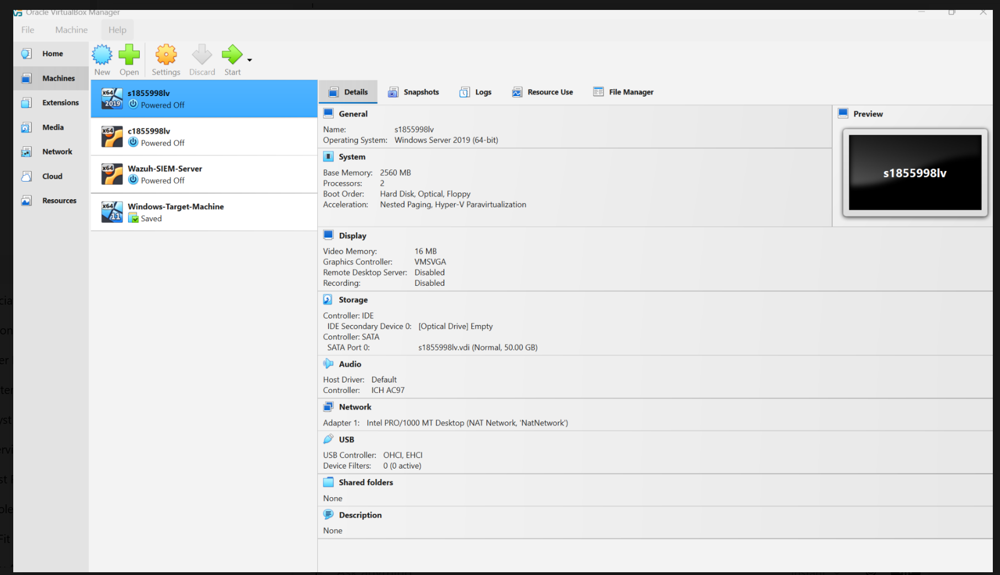
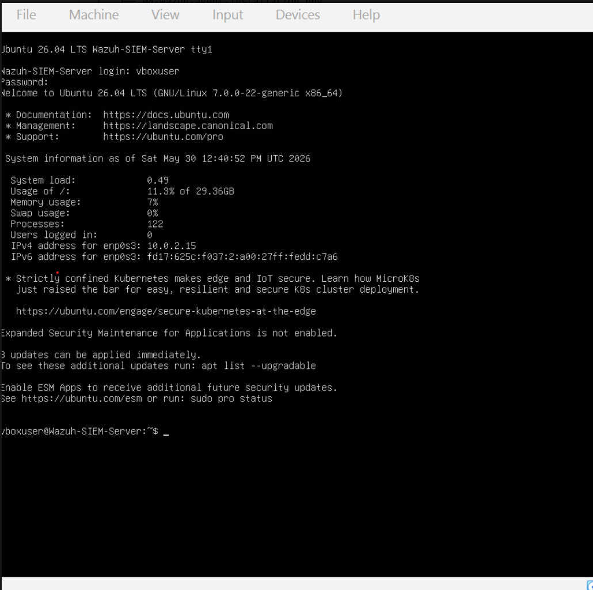
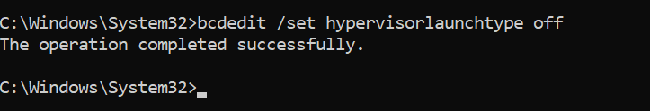
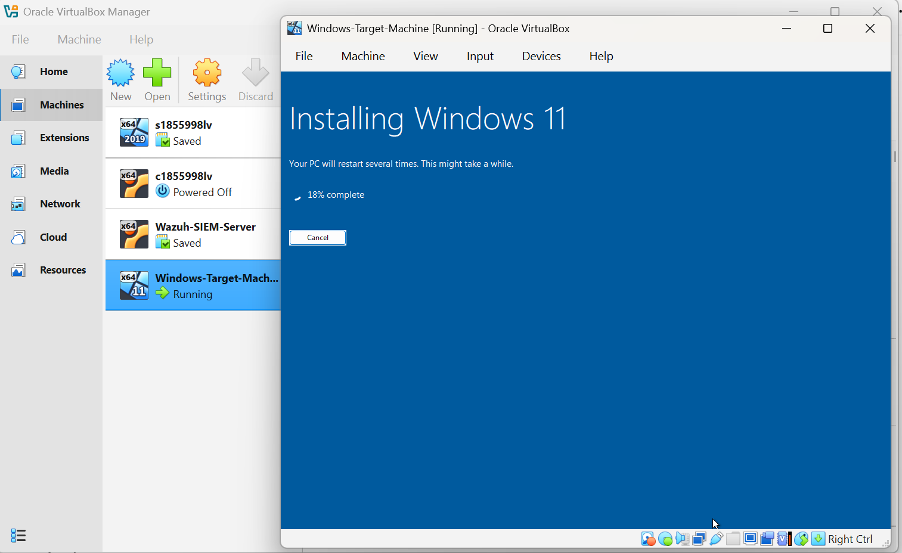
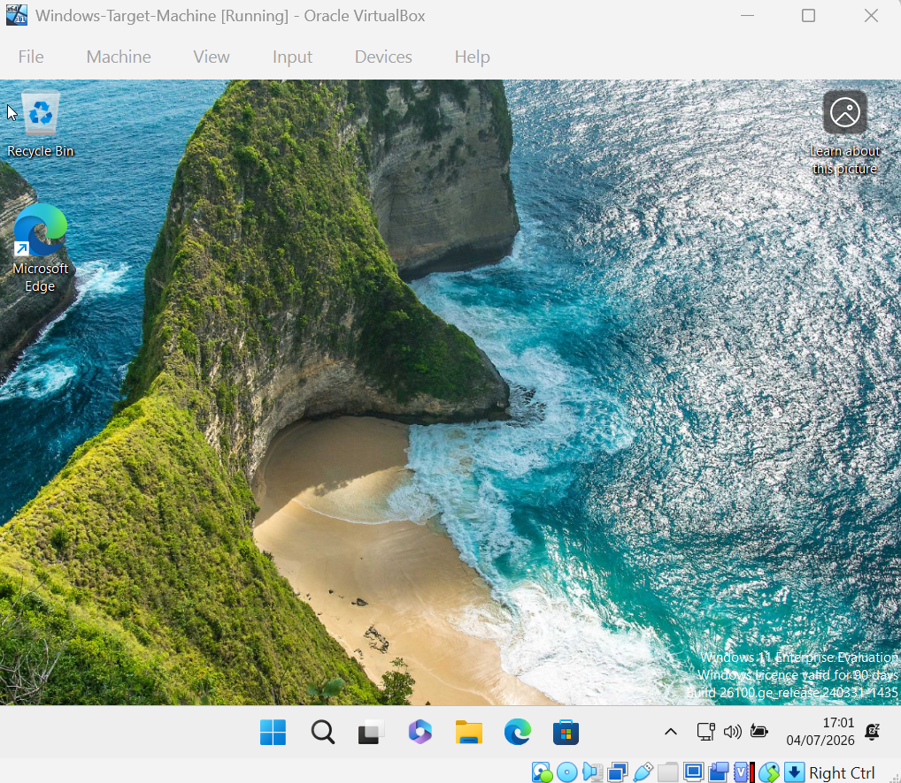
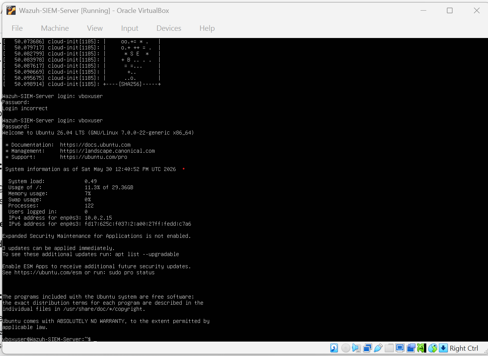

# Wazuh SIEM Home Lab

## Overview

This project documents the deployment of a Wazuh SIEM environment built inside Oracle VirtualBox for hands-on cyber security monitoring, threat hunting, and security event analysis.

The objective of the lab is to gain practical experience with SIEM deployment, endpoint monitoring, log analysis, and security event investigation similar to activities performed by SOC and Cyber Security Analysts.

## Architecture & Tools Used

* Hypervisor: Oracle VirtualBox
* SIEM Platform: Wazuh 4.14.5
* Wazuh Manager: Ubuntu Server 22.04 LTS
* Wazuh Dashboard
* Wazuh Indexer
* Monitored Endpoint: Ubuntu 22.04 Agent
* Network: Isolated VirtualBox Lab Environment

## Phase 1 – Wazuh Deployment

### Infrastructure Setup

* Deployed Ubuntu Server 22.04 LTS
* Installed Wazuh Manager
* Installed Wazuh Indexer
* Installed Wazuh Dashboard
* Verified dashboard access through the web interface

### Agent Deployment

* Installed Wazuh Agent on Ubuntu endpoint
* Registered the endpoint with the Wazuh Manager
* Verified successful communication between agent and manager
* Confirmed active agent status in the Wazuh Dashboard

### Security Monitoring Validation

Generated and detected the following security events:

* New user creation
* New group creation
* Successful sudo execution
* PAM authentication activity
* CIS Security Configuration Assessment scans

### Threat Hunting

Used the Wazuh Threat Hunting module to:

* Search events by agent
* Investigate Rule IDs
* Review authentication activity
* Analyse security events generated within the lab

## Skills Demonstrated

* SIEM Deployment and Administration
* Wazuh Agent Management
* Linux Security Monitoring
* Log Collection and Analysis
* Threat Hunting
* Security Event Investigation
* Security Configuration Assessment

## Current Status

✅ Wazuh Manager Operational

✅ Wazuh Dashboard Operational

✅ Ubuntu Endpoint Enrolled

✅ Security Events Successfully Collected

✅ Threat Hunting Functional

### Next Phase

* Deploy Windows Endpoint
* Install Wazuh Agent on Windows
* Configure Sysmon
* Generate Windows Security Events
* Investigate Event IDs
* Perform MITRE ATT&CK Mapping
* Create Detection Rules

## Learning Outcomes

This lab provides practical experience with enterprise SIEM technologies and security monitoring workflows, helping develop skills relevant to SOC Analyst, Cyber Security Analyst, and Blue Team roles.

## 📸 Lab Build Process

The screenshots below highlight the major milestones of building the Wazuh SIEM Home Lab. The complete build log (36 screenshots) is available in the `/screenshots` folder.

---

### 1. Lab Architecture

Designed the lab environment in Oracle VirtualBox with separate Ubuntu (Wazuh Server) and Windows 11 Target virtual machines.

---

### 2. Ubuntu Server Deployment

Successfully installed Ubuntu Server which hosts the Wazuh Manager, Indexer and Dashboard.

---

### 3. Hyper-V Troubleshooting

Diagnosed a VirtualBox boot failure caused by Hyper-V and Virtualization-Based Security (VBS). Used BCDEdit and Windows security settings to disable the Microsoft hypervisor and restore hardware virtualization.

---

### 4. Windows Target Machine Installation

Installed Windows 11 Enterprise Evaluation after increasing the virtual disk size from 50 GB to 80 GB.

---

### 5. Windows Target Ready

Completed Windows setup and prepared the endpoint for Wazuh agent deployment.

---

### 6. Wazuh Server Installation

Completed the Wazuh Server installation on Ubuntu.

---

### 7. Wazuh Web Login

Successfully accessed the Wazuh Dashboard through the web interface.

---

### 8. Wazuh Dashboard

Validated the deployment by accessing the Wazuh Dashboard and confirming the platform was operational.

---

## 📂 Complete Build Log

The full build process, including all **36 screenshots**, can be viewed in the [`screenshots`](screenshots/) folder.
