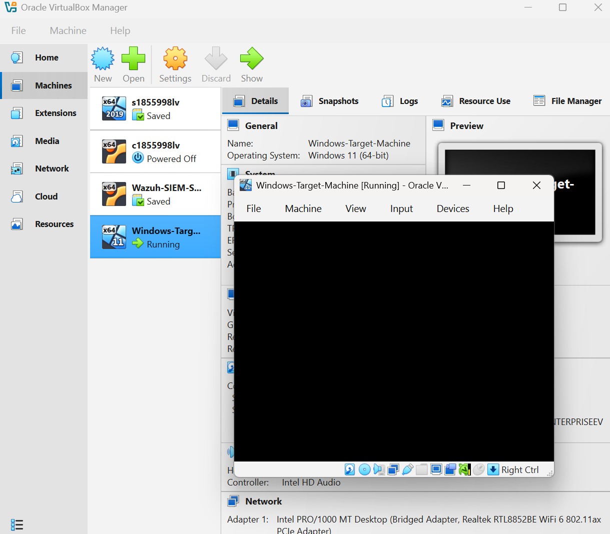
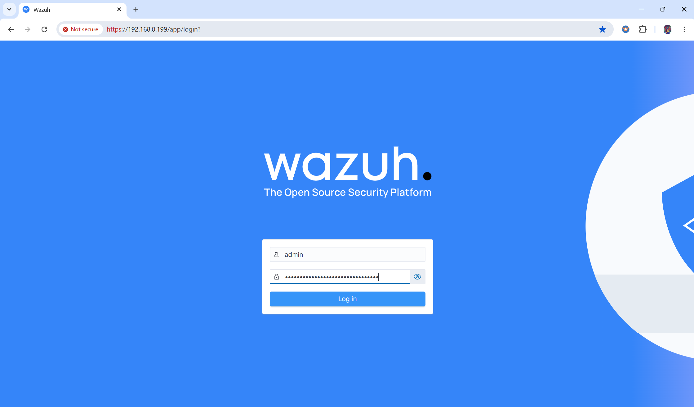
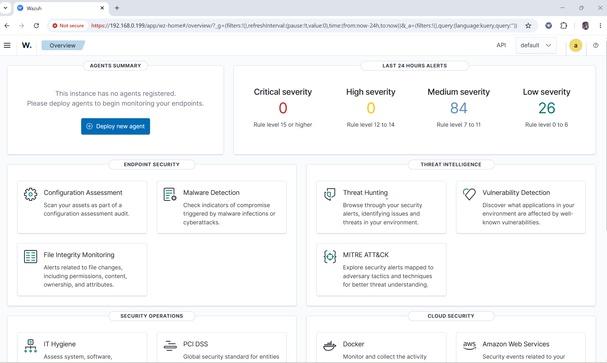

# Wazuh SIEM Home Lab

## Overview

This project documents the deployment of a Wazuh SIEM environment built inside Oracle VirtualBox for hands-on cyber security monitoring, threat hunting, and security event analysis.

The objective of the lab is to gain practical experience with SIEM deployment, endpoint monitoring, log analysis, and security event investigation similar to activities performed by SOC and Cyber Security Analysts.

## Architecture & Tools Used

* Hypervisor: Oracle VirtualBox
* SIEM Platform: Wazuh 4.14.5
* Wazuh Manager: Ubuntu Server 22.04 LTS
* Wazuh Dashboard
* Wazuh Indexer
* Monitored Endpoint: Ubuntu 22.04 Agent
* Network: Isolated VirtualBox Lab Environment

## Phase 1 – Wazuh Deployment

### Infrastructure Setup

* Deployed Ubuntu Server 22.04 LTS
* Installed Wazuh Manager
* Installed Wazuh Indexer
* Installed Wazuh Dashboard
* Verified dashboard access through the web interface

### Agent Deployment

* Installed Wazuh Agent on Ubuntu endpoint
* Registered the endpoint with the Wazuh Manager
* Verified successful communication between agent and manager
* Confirmed active agent status in the Wazuh Dashboard

### Security Monitoring Validation

Generated and detected the following security events:

* New user creation
* New group creation
* Successful sudo execution
* PAM authentication activity
* CIS Security Configuration Assessment scans

### Threat Hunting

Used the Wazuh Threat Hunting module to:

* Search events by agent
* Investigate Rule IDs
* Review authentication activity
* Analyse security events generated within the lab

## Skills Demonstrated

* SIEM Deployment and Administration
* Wazuh Agent Management
* Linux Security Monitoring
* Log Collection and Analysis
* Threat Hunting
* Security Event Investigation
* Security Configuration Assessment

## Current Status

✅ Wazuh Manager Operational

✅ Wazuh Dashboard Operational

✅ Ubuntu Endpoint Enrolled

✅ Security Events Successfully Collected

✅ Threat Hunting Functional

### Next Phase

* Deploy Windows Endpoint
* Install Wazuh Agent on Windows
* Configure Sysmon
* Generate Windows Security Events
* Investigate Event IDs
* Perform MITRE ATT&CK Mapping
* Create Detection Rules

## Learning Outcomes

This lab provides practical experience with enterprise SIEM technologies and security monitoring workflows, helping develop skills relevant to SOC Analyst, Cyber Security Analyst, and Blue Team roles.

## Lab Build Process

### Phase 1 – Virtual Machine Creation

---

### Phase 2 – Troubleshooting Hyper-V Conflict

---

### Phase 3 – Windows Target Machine Installation

---

### Phase 4 – Wazuh SIEM Deployment

